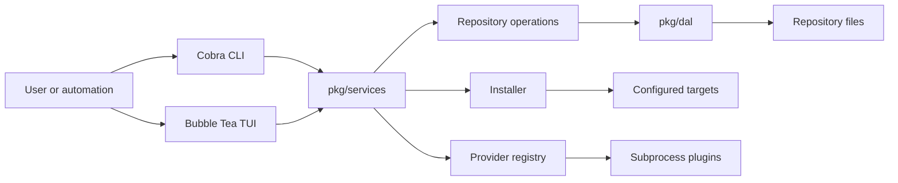

# skm

`skm` is a local manager for AI coding skills and commands. Keep a repository of reusable assets, import them from local paths or providers, install them into one or more coding tools, and keep those installations up to date.

It provides two interfaces over the same service layer:

- Run `skm` with no subcommand for the interactive terminal UI.
- Use subcommands such as `skm list --json` for automation-friendly CLI workflows.

The command root deliberately routes only a no-subcommand invocation to the TUI; CLI commands do not initialize the UI. `pkg/commands/root.go:26` [🔗](https://github.com/alswl/skm/blob/main/pkg/commands/root.go#L26)

## What it manages

An asset is either a **skill** or a **command**. Active assets live in the repository's `skills/` or `commands/` tree; archived assets are retained separately. `skm` can scan, search, import, install, uninstall, update, archive, delete, convert, verify, discover unmanaged assets, and reproduce an installation on another machine. `pkg/common/models.go:10` [🔗](https://github.com/alswl/skm/blob/main/pkg/common/models.go#L10) `docs/cli/skm.md:14` [🔗](https://github.com/alswl/skm/blob/main/docs/cli/skm.md#L14)

Install destinations are **targets**. A target declares its path, the kinds it accepts, and its installation strategy, so install behavior is driven by configuration rather than a hard-coded tool name. `pkg/common/models.go:142` [🔗](https://github.com/alswl/skm/blob/main/pkg/common/models.go#L142)

## Requirements and installation

You need Go 1.26.5 or newer (the version declared by the module) and `git` on your `PATH`. The project builds one `skm` binary from `cmd/skm`. `go.mod:3` [🔗](https://github.com/alswl/skm/blob/main/go.mod#L3) `Makefile:19` [🔗](https://github.com/alswl/skm/blob/main/Makefile#L19)

```bash
git clone git@github.com:alswl/skm.git
cd skm
make build

./bin/skm version
./bin/skm --help
```

For development checks:

```bash
make test
make lint
go test ./... -run Perf -count=1
```

`make test` runs the shared test recipe, while the repository keeps performance regression tests under `pkg/utils/perf`. `Makefile:8` [🔗](https://github.com/alswl/skm/blob/main/Makefile#L8) `pkg/utils/perf/perf_test.go:1` [🔗](https://github.com/alswl/skm/blob/main/pkg/utils/perf/perf_test.go#L1)

## Quick start

Start in a repository that contains `skills/` or `commands/`. With no `--root`, skm searches upward from the current directory; `--root` may name the repository root or a `skills/` directory. `pkg/commands/root.go:76` [🔗](https://github.com/alswl/skm/blob/main/pkg/commands/root.go#L76)

```bash
# Open the TUI
./bin/skm

# Or work through the CLI
./bin/skm list --json
./bin/skm import ./my-skill --kind skill --force
./bin/skm install my-skill --target codex --json
./bin/skm status my-skill --json
./bin/skm update my-skill
./bin/skm normalize misplaced-skill --provider local
```

Use `--dry-run` to report a write operation without changing files, and use `--force` to explicitly authorize overwrite or destructive behavior. With `--json`, results go to stdout; `--timing` writes timing information only to stderr. `pkg/commands/root.go:65` [🔗](https://github.com/alswl/skm/blob/main/pkg/commands/root.go#L65)

## Common workflows

### Install and maintain assets

```bash
# Install into all compatible targets, or select targets explicitly.
./bin/skm install review
./bin/skm install review --target codex --target claude-skills

# Remove only installations managed by skm; user-owned files are not removed.
./bin/skm uninstall review --target codex

# Refresh one imported asset, or all active assets with an origin.
./bin/skm update review
./bin/skm batch-update --json
```

The install command matches targets by the asset kind, and uninstall is constrained to managed installs. `pkg/commands/install.go:16` [🔗](https://github.com/alswl/skm/blob/main/pkg/commands/install.go#L16) `docs/cli/skm_uninstall.md:5` [🔗](https://github.com/alswl/skm/blob/main/docs/cli/skm_uninstall.md#L5)

### Import, inspect, and curate

```bash
./bin/skm import ./local-command --kind command --force
./bin/skm import git@github.com:org/skills.git --json
./bin/skm info review
./bin/skm archive old-skill --force
./bin/skm unarchive old-skill
./bin/skm verify repo --json
```

An import can use a local path or a provider address; `--provider` selects a provider when automatic routing is not enough. `pkg/commands/import.go:14` [🔗](https://github.com/alswl/skm/blob/main/pkg/commands/import.go#L14)

### Reconcile external and non-standard skills

```bash
# Inspect unmanaged skills, then take one into the repository or remove it.
./bin/skm discover --json
./bin/skm adopt ~/.codex/skills/review
./bin/skm delete-external ~/.codex/skills/obsolete --force

# Move a repository skill found outside the standard layout.
./bin/skm normalize misplaced-skill --provider local
```

Every TUI operation that changes repository, target, or external-skill state has a CLI counterpart.
The TUI task center is intentionally excluded: its queue is scoped to the running TUI process and has
no CLI equivalent. `pkg/commands/external.go:25` [🔗](https://github.com/alswl/skm/blob/main/pkg/commands/external.go#L25) `pkg/commands/lifecycle.go:58` [🔗](https://github.com/alswl/skm/blob/main/pkg/commands/lifecycle.go#L58)

### Move a setup to another machine

```bash
# On the source machine, print a safe deploy command for current installations.
./bin/skm export

# On the destination machine, configure matching targets and run it.
./bin/skm deploy --repo git@host:team/skills.git --target codex --only review,release
```

`deploy` can clone or pull a git repository and batch-install selected entries; `export` emits nothing when there is no installation to reproduce. `pkg/commands/deploy.go:14` [🔗](https://github.com/alswl/skm/blob/main/pkg/commands/deploy.go#L14) `pkg/commands/deploy.go:57` [🔗](https://github.com/alswl/skm/blob/main/pkg/commands/deploy.go#L57)

## TUI

Launch the TUI with `./bin/skm`. It offers a searchable catalog, entry detail, a background task center, target editor, confirmations for destructive operations, and context-aware footer hints. The task center is opened with `J`; target management is opened with `t`. `pkg/tui/list.go:74` [🔗](https://github.com/alswl/skm/blob/main/pkg/tui/list.go#L74) `pkg/tui/list.go:132` [🔗](https://github.com/alswl/skm/blob/main/pkg/tui/list.go#L132)

The footer dims actions that are not currently available. Pressing an unavailable action reports why in the status area instead of silently doing nothing—for example, when no job or target is selected. `pkg/tui/tasks_view.go:28` [🔗](https://github.com/alswl/skm/blob/main/pkg/tui/tasks_view.go#L28) `pkg/tui/target_editor.go:51` [🔗](https://github.com/alswl/skm/blob/main/pkg/tui/target_editor.go#L51)

Press `?` in the main list for the complete key map. The current screen's footer is the quickest reference for available actions.

## Targets and configuration

By default, skm includes targets for Claude skills, Claude commands, Codex, and pi. Custom targets live in `targets.json` in the config directory. The default is `$XDG_CONFIG_HOME/skm` when `XDG_CONFIG_HOME` is set, otherwise `~/.config/skm`; `--config` overrides it. `pkg/config/config.go:37` [🔗](https://github.com/alswl/skm/blob/main/pkg/config/config.go#L37) `pkg/config/config.go:80` [🔗](https://github.com/alswl/skm/blob/main/pkg/config/config.go#L80)

```bash
./bin/skm target list --json
./bin/skm target add --name my-tool --platform mytool --path ~/.mytool/skills \
  --accepts skill --strategy skill=skill-symlink
./bin/skm target validate my-tool --json
./bin/skm target update --name my-tool --path ~/.mytool/skills-v2
```

Target configuration supports the built-in `skill-symlink`, `command-marker`, and `command-adapter` strategies, plus `plugin:<id>` strategies supplied by target plugins. `pkg/common/models.go:61` [🔗](https://github.com/alswl/skm/blob/main/pkg/common/models.go#L61)

## Providers and plugins

Providers acquire assets. skm ships Local, SelfBuild, GitHub, GitLab, and Skills.sh providers, then discovers external provider plugins. `pkg/services/services.go:17` [🔗](https://github.com/alswl/skm/blob/main/pkg/services/services.go#L17)

Plugins are executable programs, not Go packages. Put them beneath a plugin base directory:

```text
~/.config/skm/plugins/
├── providers/   # acquisition plugins
└── targets/     # installation-strategy plugins
```

Set `SKM_PLUGINS_DIR` to add one or more base directories. Plugin discovery loads independent executables concurrently and isolates failures, retaining the path and reason for diagnostics instead of stopping skm. `docs/plugins/README.md:12` [🔗](https://github.com/alswl/skm/blob/main/docs/plugins/README.md#L12) `pkg/services/provider_plugin_discovery.go:13` [🔗](https://github.com/alswl/skm/blob/main/pkg/services/provider_plugin_discovery.go#L13)

```bash
./bin/skm provider list --json
./bin/skm provider validate --json
./bin/skm target plugin list --json
```

The plugin request/response protocol, error codes, and working templates are documented in [docs/plugins/README.md](docs/plugins/README.md).

## Architecture



`cmd/skm` is intentionally a thin process entry point. Cobra commands and the TUI create the shared `services.Services` orchestrator; it owns repository, provider, installer, and target-plugin behavior, keeping writes out of UI and command adapters. `cmd/skm/main.go:10` [🔗](https://github.com/alswl/skm/blob/main/cmd/skm/main.go#L10) `pkg/services/services.go:8` [🔗](https://github.com/alswl/skm/blob/main/pkg/services/services.go#L8)

```text
cmd/
  skm/          executable entry point
  gendoc/       Cobra Markdown documentation generator
pkg/
  commands/     CLI command definitions and output adapters
  services/     shared business operations and orchestration
  tui/          Bubble Tea screens, actions, and UI components
  common/       domain models, errors, and logging
  config/       root discovery, configuration, and targets
  dal/          locks, transactions, metadata, and filesystem access
  jobs/         background-job queue used by the TUI
  plugins/      subprocess plugin protocol and discovery helpers
  utils/        pagination, timing, and performance helpers
docs/
  cli/          generated command reference
  plugins/      plugin protocol and templates
```

## Command reference and contributing

Run `./bin/skm --help` for an overview and `./bin/skm <command> --help` for command-specific flags and examples. Generated Markdown reference lives in [docs/cli](docs/cli/).

When changing the CLI, keep command handlers thin: parse arguments and format output in `pkg/commands`, and put shared behavior in `pkg/services`. The TUI uses the same services layer. `pkg/commands/root.go:82` [🔗](https://github.com/alswl/skm/blob/main/pkg/commands/root.go#L82)

Before submitting a change, run:

```bash
make build
go test ./...
golangci-lint run
```
