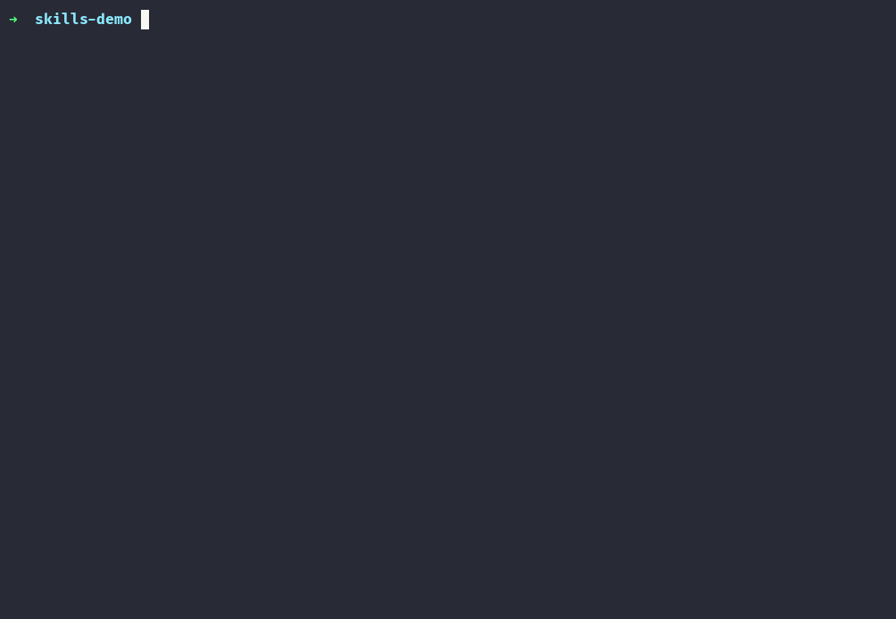

# skm

**本地优先的 AI 编程技能管理：一个个人 Git 仓库，处处同步安装。**

[English](README.md) | 简体中文

[](https://github.com/alswl/skm/actions/workflows/ci.yml)
[](go.mod)
[](https://github.com/alswl/skm/releases)
[](LICENSE)

Claude Code 有 `~/.claude/skills`，Codex 有 `~/.codex/skills`，Pi 又是自己的一套。每接入一个新的
AI 编程工具,就多一个技能目录，你精心写好的技能最后被复制粘贴进每一个目录——彼此不同步，重复堆积，
悄悄腐烂。

`skm` 用**你自己的、本地优先的 Git 仓库**统一管理技能（skills）和命令（commands），并把它们安装到
你用的每一个工具里。已有本地技能可以直接收编；GitHub、GitLab、Skills.sh 和本地文件也都能导入。之后
一键自动化批量更新，或在 TUI 中浏览、在 CI 里脚本化。



每个工具一列，`✓` 表示已在该工具中安装。核心思路就这么简单。

## ✨ 你能得到什么

- 📦 **本地优先，归你掌控。** 技能保存在你的个人 Git 仓库里：纯目录加 Markdown，离线可用；像管理
  代码一样提交、分支、评审和备份。
- 📥 **多平台导入，原有技能不浪费。** 可从 GitHub、GitLab、Skills.sh、本地路径或文件导入；还能发现并
  收编已安装在 Claude Code、Codex 等工具中的本地 skills。
- 🔄 **一键自动化批量更新。** `skm update --all`（TUI 中按 `P`）逐个更新所有可更新的条目，并保留每项
  结果，省去挨个处理的重复劳动。
- 🔁 **写一次，处处安装。** `skm install code-review` 会装进所有接受该类型的工具，不用再维护三份
  互相不同步的拷贝。
- 🔍 **随时知道现状。** 安装状态列和 `skm status` 会告诉你哪里已装、哪里失效、哪里和源头不一致了。
- 🔌 **高度可扩展。** 平台和目标都是配置，不是代码：`skm target add` 可接入新的本地安装位置；provider
  与 target 插件还能对接自定义平台和安装方式，不用等版本发布。

provider 决定资产从哪里来，target 决定它们装到哪里。两者都自带内置实现，也都可以用纯可执行文件
扩展——不需要 Go，不需要重新编译 skm。

| Provider | 带来什么 |
|---|---|
| Local | 本地磁盘上的一个路径 |
| SelfBuild | 你就地编写的一个 skill/command |
| GitHub | 一个仓库、一个子目录，或直接一个文件的 URL——粘贴 `owner/repo`、`owner/repo/path/to/skill`，或地址栏里的 `blob` 链接都行 |
| GitLab | 任意 GitLab 仓库 |
| Skills.sh | Skills.sh 注册表 |
| *自定义* | 任何插件可执行文件能拉取到的东西 |

| Target | 装到哪里 |
|---|---|
| Claude skills | `~/.claude/skills` |
| Claude commands | `~/.claude/commands` |
| Codex | `~/.codex/skills` |
| pi | `~/.pi/agent/skills` |
| *自定义* | 任意路径，通过 `skm target add` 添加 |

## 🏁 快速上手

下载对应平台的发布二进制、校验 checksum，并安装到 `PATH` 中第一个可写的目录：

```bash
curl -fsSL https://raw.githubusercontent.com/alswl/skm/master/install.sh | sh
```

## 🚀 首次运行

让 skm 指向你的技能仓库，然后直接运行 `skm`——这是主要的使用方式：

```bash
skm init ~/skills && cd ~/skills
skm
```

你会看到一个可搜索的目录列表，每个工具一列安装状态，还有条目详情、目标编辑器（`t`）、以及后台任务
中心（`J`）——长时间运行的任务在这里汇报进度，你可以继续浏览别的内容。

不用从空仓库开始——你的 `~/.claude/skills`、`~/.codex/skills` 之类的地方大概率已经躺着一些技能了。
按 `o` 发现它们，`enter` 收编你想要的进仓库。

| 按键 | 作用 |
|---|---|
| `j` / `k` | 上下移动 · `/` 搜索 · `enter` 详情 |
| `i` | 对选中条目执行安装/卸载 |
| `m` | 导入 · `p` 更新 · `P` 全部更新 · `a` 归档 · `d` 删除 |
| `o` | 发现未受管理的技能 · `c` 收编进仓库 |
| `x` | 当前条目的全部操作 |
| `t` | 目标管理 · `J` 任务中心 · `?` 完整按键表 |

底部状态栏始终显示*此刻*能做什么——不可用的操作会变暗，按下去会告诉你原因，而不是悄无声息地什么
都不做。破坏性操作的确认提示会先说清楚后果。

想用脚本？每个操作都有对应的 CLI 命令：

```bash
skm discover
skm adopt ~/.codex/skills/review
skm import ./my-skill --kind skill
skm install code-review --target codex
skm list
skm status code-review
```

然后对这个仓库执行 `git init && git commit`，大功告成——你的技能现在被版本化、可迁移，并且已经装
进了每一个工具。

## 🔌 插件

自定义 provider 和 target 以插件形式和内置实现放在一起——一个坏掉、卡住或运行缓慢的插件是被隔离
的，不会拖垮 skm，也不会阻塞其他插件：

```text
~/.config/skm/plugins/
├── providers/   # 资产从哪里来
└── targets/     # 怎么安装资产
```

```bash
skm target add --name my-tool --platform mytool --path ~/.mytool/skills \
  --accepts skill --strategy skill=skill-symlink
skm provider list && skm provider validate
skm target plugin list
```

协议细节、错误码和可用的模板：[docs/plugins/README.md](docs/plugins/README.md)。

## 📚 文档与开发

完整命令参考：[docs/cli](docs/cli/)——或者对任何命令执行 `skm <command> --help`。想从源码构建：

```bash
git clone git@github.com:alswl/skm.git && cd skm && make build && make install
```

```bash
make build && make test && make lint
```

## License

MIT © Jingchao —— 详见 [LICENSE](LICENSE)。
